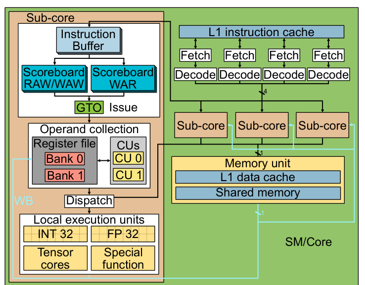
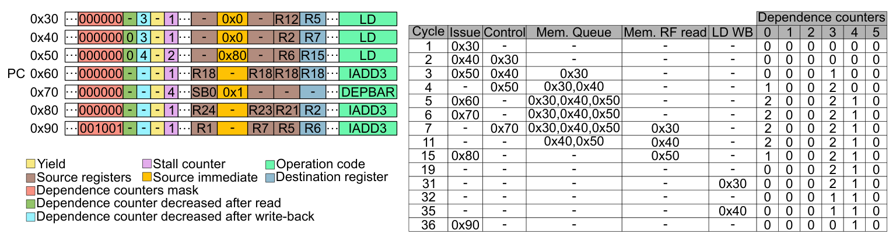
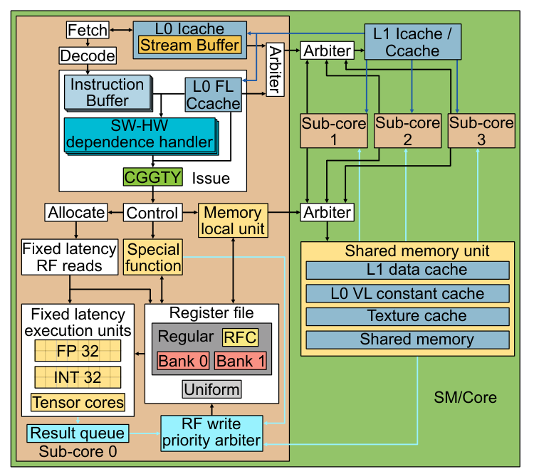
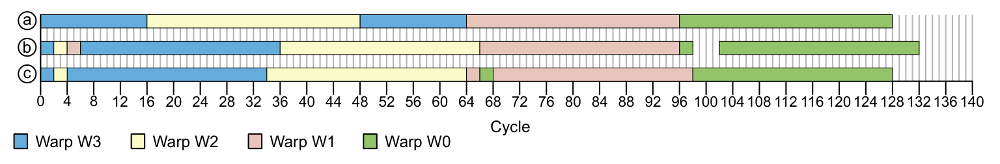
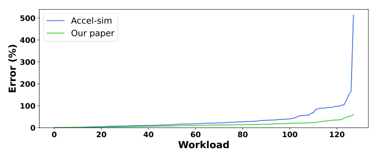

<!-- Converted from micro25-nv.pdf. Figures use relative paths under images/. Tables are converted to Markdown tables. -->

PDF Download 3725843.3756041.pdf 27 February 2026 Total Citations: 2 Total Downloads: 7263

Latest updates: https://dl.acm.org/doi/10.1145/3725843.3756041

Published: 17 October 2025

## RESEARCH-ARTICLE

# Dissecting and Modeling the Architecture of Modern GPU Cores

Citation in BibTeX format

MICRO 2025: 58th IEEE/ACM International Symposium on Microarchitecture October 18 - 22, 2025 Seoul, Korea

RODRIGO HUERTA, Polytechnic University of Catalonia, Barcelona, Barcelona, Spain

MOJTABA ABAIE SHOUSHTARY, Polytechnic University of Catalonia, Barcelona, Barcelona, Spain

Conference Sponsors: SIGMICRO

JOSÉ-LORENZO CRUZ, Polytechnic University of Catalonia, Barcelona, Barcelona, Spain

ANTONIO GONZALEZ, Polytechnic University of Catalonia, Barcelona, Barcelona, Spain

Open Access Support provided by:

Polytechnic University of Catalonia

MICRO '25: Proceedings of the 58th IEEE/ACM International Symposium on Microarchitecture (October 2025) https://doi.org/10.1145/3725843.3756041 ISBN: 9798400715730

# Dissecting and Modeling the Architecture of Modern GPU Cores

Rodrigo Huerta Universitat Politècnica de Catalunya Barcelona, Spain rodrigo.huerta.ganan@upc.edu

Mojtaba Abaie Shoushtary Universitat Politècnica de Catalunya Barcelona, Spain mojtaba.abaie@upc.edu

José-Lorenzo Cruz Universitat Politècnica de Catalunya Barcelona, Spain cruz@ac.upc.edu

Antonio Gonzalez Universitat Politècnica de Catalunya Barcelona, Spain antonio@ac.upc.edu

## Abstract

GPUs are the most popular platform for accelerating HPC workloads, such as artificial intelligence and science simulations. However, most microarchitectural research in academia relies on simulators that model GPU core architectures based on designs that are more than 15 years old, and differ significantly from modern core architectures. This work reverse engineers the architecture of modern NVIDIA GPU cores, unveiling key aspects of its design and the important role of the compiler in some of its main components. In particular, it reveals how the issue logic works, the structure of the register file and its associated cache, multiple features of the instruction and data memory pipelines. When modeling all these discovered microarchitectural details in a state-of-the-art simulation framework, we show that its accuracy is significantly improved, achieving a 20.58% reduction in mean absolute percentage error (MAPE) on average, which results in a 13.45% MAPE on average with respect to real modern hardware. In addition, we show that the software-based dependence management mechanism included in modern NVIDIA GPUs outperforms a hardware mechanism based on scoreboards in terms of performance and area.

## CCS Concepts

- Computer systems organization → Single instruction, multiple data; Multicore architectures; • Computing methodologies → Modeling methodologies; Model verification and validation; Simulation evaluation; Simulation tools.

## Keywords

GPGPU, GPU Core, GPU Microarchitecture, Modeling, Simulation, Validation, Scheduling, Reverse engineering, NVIDIA, Turing, Ampere, Blackwell

Permission to make digital or hard copies of all or part of this work for personal or classroom use is granted without fee provided that copies are not made or distributed for profit or commercial advantage and that copies bear this notice and the full citation on the first page. Copyrights for components of this work owned by others than the author(s) must be honored. Abstracting with credit is permitted. To copy otherwise, or republish, to post on servers or to redistribute to lists, requires prior specific permission and/or a fee. Request permissions from permissions@acm.org. MICRO ’25, Seoul, Republic of Korea © 2025 Copyright held by the owner/author(s). Publication rights licensed to ACM. ACM ISBN 979-8-4007-1573-0/25/10 https://doi.org/10.1145/3725843.3756041

## ACM Reference Format

Rodrigo Huerta, Mojtaba Abaie Shoushtary, José-Lorenzo Cruz, and Antonio Gonzalez. 2025. Dissecting and Modeling the Architecture of Modern GPU Cores. In 58th IEEE/ACM International Symposium on Microarchitecture (MICRO ’25), October 18–22, 2025, Seoul, Republic of Korea. ACM, New York, NY, USA, 16 pages. https://doi.org/10.1145/3725843.3756041

## 1 Introduction

In recent years, GPUs have become very popular for executing general-purpose workloads [22] in addition to graphics. GPUs’ architecture provides massive parallelism that can be leveraged by many modern applications such as bioinformatics [24, 65], physics [56, 96], and chemistry [41, 98], to name a few. Nowadays, GPUs are the main candidates to accelerate modern machine learning workloads, which have high memory bandwidth and computation demands [28]. Over the last years, there have been significant innovations in GPUs’ microarchitecture, their interconnection technologies (NVLink [68]), and their communication frameworks (NCCL [69]). All these advances have enabled inference and training of Large Language Models, which require clusters with many GPUs [62]. GPUs are expected to keep being an important computing platform in the future, and innovations in their architecture are going to be key to provide rich user experiences in many domains. These innovations rely on research done both in industry and academia, and cycle-level simulators play a key role in this process. However, there is scarce information on the architecture of modern commercial GPUs, and most current academic studies are based on simulators [18, 53] that use the Tesla microarchitecture [55] as the baseline, which was launched in 2006. GPU architectures have undergone significant changes since Tesla, hence, the reported findings when evaluating a new idea may differ for a more up-to-date model. This work aims to bridge this gap by unveiling key features and details of modern NVIDIA GPU architectures, and incorporating them in a state-of-the-art GPU simulator. This improved simulator is shown to provide much higher accuracy when compared with real hardware. For instance, for an Ampere RTX A6000 GPU, the improved model has an average error in estimated execution time of 13.45%, which is less than half of the error of the original simulator (34.03%). Additionally, to the best of our knowledge, this is the first work that models the latest NVIDIA GPU architecture, Blackwell, with high accuracy, achieving a MAPE of 17.41%. These results demonstrate the relevance of our findings for recent NVIDIA architectures. A more accurate GPU model will allow researchers

to better identify challenges and opportunities for improving future GPUs. In summary, this work makes the following contributions:

- It discloses the operation of the issue stage, including dependence handling, readiness conditions of warps, and the issue scheduler policy.
- It presents a plausible operation of the fetch stage and its scheduler.
- It provides key details of the register file and the register file cache. Moreover, it shows that modern NVIDIA GPUs do not use an operand collection stage or collector units.
- It reveals multiple details of the data and instruction memory pipeline.
- We redesign the SM/core model used in Accel-sim simulator [53] from scratch and integrate all the findings revealed in this work into the model.
- We validate the new model against real hardware, including the latests NVIDIA architecture (Blackwell) and compare it against the Accel-sim simulator [53]. The new model achieves a mean absolute percentage error (MAPE) of execution cycles against real hardware of 13.45%, whereas the previous simulator model has a MAPE of 34.03%.
- We show that the software-based dependence management system of modern GPUs that we unveil in this paper is a more efficient alternative than traditional scoreboards in terms of performance and hardware cost.

The rest of this paper is organized as follows. First, we introduce some background and motivation of this work in section 2. In section 3, we explain the reverse engineering methodology that we have employed. Then, we describe the control bits in modern NVIDIA GPU architectures and their detailed behavior in section 4. Later, we present the core microarchitecture of these GPUs in section 5. Next, we describe changes we have performed in the baseline Accel-sim simulator in section 6. Section 7 evaluates the accuracy of our model against real hardware and compares it to the Accel-sim framework simulator. It also analyzes the impact of various microarchitecture features, and compares different dependence management mechanisms. Section 8 reviews related work and finally, section 9 summarizes the main conclusions of this work.

## 2 Background and Motivation

Most GPU architecture research in academia relies on the model that GPGPU-Sim simulator implements [1, 18]. Recently, this simulator was updated to include sub-cores (Processing Blocks in NVIDIA terminology) that started to be used in Volta. Figure 1 shows a block diagram of the architecture modeled in this simulator. We can observe that it comprises four sub-cores and some shared components, such as the L1 instruction cache, L1 data cache, shared memory, and texture units. Below, we summarize some of the key components of this model. In the Fetch stage, a round robin scheduler selects four warps and requests two instructions per warp from the L1 instruction cache. A warp is eligible to be selected if its Instruction Buffer is empty. This model does not take into account to which sub-core the warps belong, and most instructions are modeled as performing the fetch and decode stages in the same cycle [43]. The Instruction Buffer is a private buffer per warp to store the instructions after



**Figure 1: SM/Core model of Accel-sim.**

they are fetched and decoded. Instructions stay in this buffer until they are ready and selected to be issued. In the Issue stage, the scheduler selects a warp among those not waiting on a barrier and with its oldest instruction ready following a Greedy Then Oldest (GTO) [85] policy. Each warp has two scoreboards for checking the data dependence. The first one marks pending writes to the registers to track WAW and RAW dependencies. An instruction can be issued only when all its operands are cleared in this scoreboard. The second scoreboard counts the number of in-flight consumers of registers to prevent WAR hazards [63]. The second scoreboard is necessary because although instructions are issued in-order, their operands might be fetched out of order, due to the assumption of an operand collection unit, which may delay the read of source operands. Besides, memory instructions are sent to operand collection after being issued and may read its source operands after a younger arithmetic instruction writes its result. Once an instruction is issued, it is placed in a Collector Unit (CU) to retrieve its source register operands. Each sub-core has a private register file with multiple banks that can be accessed in parallel. An arbiter deals with the possible conflicts among several petitions to the same bank. When all source operands of an instruction are in the CU, the instruction moves to the Dispatch stage, where it is assigned to the proper execution unit (e.g., memory, single-precision, special function) whose latencies differ depending on the unit type and instruction. After execution, the instruction reaches the write-back stage in which the result is written in the register file. This GPU microarchitecture modeled in Accel-sim [53] resembles NVIDIA GPUs based on Tesla [55], which was released in 2006, and updated with a few modern features, mainly a sub-core model and sectored caches with IPOLY [83] indexing similar to Volta [53]. However, it lacks some important components that are present in modern NVIDIA GPUs, such as the L0 instruction cache [21, 29, 70, 71, 73–76] and the uniform register file [21]. Moreover, some main components of sub-cores, such as the issue logic,

register file, or register file caches, among others, are not updated to reflect current designs. A main challenge to develop an accurate model of modern GPU cores is that most of these details have not been disclosed. This work aims to reverse engineer the microarchitecture of the core in modern NVIDIA GPUs and update Accel-sim to incorporate the unveiled features. This will allow users of this updated Accel-sim simulator to make their work more relevant by starting with baselines closer to those proven successful by the industry in commercial designs.

## 3 Reverse Engineering Methodology

This section explains our research methodology for discovering the architecture of the NVIDIA Blackwell, Ampere and Turing GPU cores (SMs). Our approach is based on writing small microbenchmarks and measure their execution time when executed in the real hardware. The elapsed cycles are obtained by surrounding the code with instructions that save the CLOCK counter of the GPU into a register, and store it in main memory for later post-processing. The evaluated sequence of instructions typically consists of hand-written SASS instructions (NVIDIA assembly language), including their control bits. We analyze the recorded cycles to confirm or refute a particular hypothesis about the semantics of the control bits or a particular feature in the microarchitecture. Two examples to illustrate this methodology are given below:

- We have used the code in Listing 1 to unveil the conflicts of the multi-banked register file (subsection 5.3). We have run multiple versions of this code by replacing R_X and R_Y with different registers. We observed that when the two registers had an odd number (e.g., R19 and R21), we get an elapsed time of five cycles (the minimum since each sub-core can issue one instruction per cycle). If we change R_X to an even number (e.g., R18) while maintaining R_Y odd (e.g., R21), the reported number of cycles is six. Finally, the elapsed time is seven cycles if we use an even number for both operands (e.g., R18 and R20). In summary, two consecutive instructions can have from 0 to 2 cycles of bubbles in between, depending on which registers they use.
- A different example is our study of the issue scheduler policy (section 5.1.2). For this analysis, we executed multiple CLOCK instructions within each warp of the same sub-core. By aggregating these measurements, we constructed the timeline shown in Figure 4, which enabled us to deduce the warps’ scheduling policy.

```text
CLOCK
NOP
FFMA R11, R10, R12, R14
FFMA R13, R16, R_X, R_Y
NOP
CLOCK
```

**Listing 1: Code used to check Register File read conflicts.**

Although NVIDIA has no official tool to write SASS code directly, various third-party tools allow programmers to rearrange and modify SASS assembly code (including control bits). These tools are used, for example, to optimize performance in critical kernels when the compiler generated code is not optimal. MaxAS [37] was the first tool for modifying SASS binaries. Later on, other tools such as KeplerAS [102, 103] were developed for Kepler architecture. Then, TuringAS [99] and CUAssembler [30] appeared to support more

recent architectures. For this work, we use CUAssembler due to its flexibility, extensibility, and support for a wide range of modern NVIDIA architectures.

## 4 Control Bits in Modern NVIDIA GPU Architectures

The machine instructions of modern NVIDIA GPU architectures contain some bits that the compiler/programmer must set appropriately to handle data dependencies at run time [67]. In modern NVIDIA architectures, data dependencies are not managed by scoreboards, but the compiler is in charge of guiding the hardware to guarantee that these dependencies are obeyed. Besides, machine instructions include some other bits that the compiler/programmer must set accordingly to manage the register file cache, which improves performance and reduces energy consumption. These bits are referred to as control bits. Below, we describe the behavior of these control bits. Some documents [30, 37, 46, 47] describe them, but these documents are often ambiguous or incomplete, so we use the methodology described in section 3 to uncover the semantics of these control bits and verify that they act as described below. Each sub-core can issue a single instruction per cycle. By default, the Issue Scheduler tries to issue instructions of the same warp if the oldest instruction in program order of that warp is ready. The compiler indicates when an instruction will be ready for issue by means of the control bits. If the oldest instruction of the warp that issued an instruction in the previous cycle is not ready, the issue logic selects an instruction from another warp, following the policy described in subsection 5.1. Data dependencies are handled in a different manner depending on whether the producer instruction has fixed or variable latency. For dependencies with a fixed latency, each warp has a counter that is referred to as Stall counter. If this counter is not zero, this warp is not allowed to issue instructions. This counter can be set to a particular value by means of some control bits in each instruction. For each dependence, the compiler sets these control bits in the producer instruction with its latency minus the number of instructions between the producer and the first consumer. All these per-warp Stall counters are decreased by one every cycle until they reach 0. The issue logic simply checks this counter and will not consider any warp whose counter is not zero. For example, an addition whose latency is four cycles and its first consumer is the following instruction encodes a four in the Stall counter. The maximum value that each instruction can encode in the Stall counter is 15. In Listing 2, we show the code used to unveil the semantics of the Stall counter. The values of R1, R2, R3, and R4 are set to one to establish a controlled output. The core of the experiment involves measuring clock cycles elapsed in the code region bracketed by NOP instructions as described in section 3, and the result of the FFMA instruction. Within this region, a FADD instruction is immediately followed by a data-dependent FFMA. The last instruction transfers the clock values (R14 and R24) and the content of R5 to memory to verify the computation. We run multiple versions of this code, changing the value of the Stall counter of the fourth FADD, and checked the elapsed time and the result of the last FFMA. We

observed that if we set the target Stall counter to one, the elapsed time measured between the two clocks is five. However, the result obtained in R5 is two, which is wrong. On the other hand, if we set this Stall counter to four, the elapsed time computed between clocks is eight, and the content of R5 is six, as expected. Note that the third FADD has a Stall counter set to two to avoid a data dependence with the fourth FADD.

```text
FADD R1, RZ, 1 # Stall counter set to 1.
FADD R2, RZ, 1 # Stall counter set to 1.
FADD R3, RZ, 1 # Stall counter set to 2.
CS2R.32 R14, SR_CLOCK0 # Stall counter set to 1.
NOP # Stall counter set to 1.
FADD R1, R2, R3 # Target Stall counter.
FFMA R5, R1, R1, R1 # Stall counter set to 1.
NOP # Stall counter set to 1.
CS2R.32 R24, SR_CLOCK0 # Stall counter set to 1.
```

**Listing 2: Code to analyze Stall counters behavior.**

Using the methodology explained in section 3, we have verified that if the Stall counter is not properly set according to the above scheme, the result of the program is incorrect. This proves that the hardware does not check for RAW hazards, and simply relies on these compiler-set counters. We observed a special behavior when the stall counter exceeds 11 while the Yield bit (introduced later) is set to 0: the warp stalls for only one or two cycles. This counterintuitive combination never appears in compiler-generated code and was generated by manually setting the control bits in our experiments. We also identified a special scenario—triggered by the ERRBAR instruction and by a self-branch inserted immediately after the kernel’s EXIT—in which the stall counter is set to 0 and the yield bit to 1. Under these conditions, the warp remains stalled for exactly 45 cycles before issuing its next instruction. This compiler-assisted mechanism to handle data dependencies requires less hardware and consumes less energy than a traditional scoreboard approach since there is no need for a hardware table with the register status neither wires from the issue logic to the scoreboards. When the producer instruction has variable latency (e.g., memory, special functions), the compiler does not know its execution time, so these hazards cannot be handled through the Stall counters. In this case, Dependence counters are used. Each warp has six special registers to store these counters, which are referred to as SBx with x taking a value in the range [0−5]. Each of these registers can store a value in the range of 0 to 63, and they are initialized to zero when a warp starts. In each instruction, there are some control bits to indicate up to two counters that are increased after issue. One of these counters is decreased at write-back (to handle RAW and WAW dependencies) and the other at register read (to handle WAR dependencies). For this purpose, every instruction has two fields of 3 bits each to indicate these two counters. Besides, every instruction has a mask of 6 bits to indicate which dependence counters it has to check to determine if it is ready for issue. We refer to this mask as Dependence counters mask. Note that an instruction can check up to all six counters. Instructions that depend on older variable-latency instructions have the corresponding Dependence counters set to one in the Dependence counters mask, and are stalled until these counters reach zero. Note that if an instruction has multiple source operands whose producers have variable latency, the same Dependence counter can

be used by all these producers without losing any parallelism. On the other hand, in scenarios where there are more than six producer instructions with different consumer instructions that are all younger (in program order) than the younger producer, the compiler has two alternatives. First, it can try to reorder the code to avoid this scenario; otherwise, some Dependence counters must be shared by more than one producer-consumer pair. Note that in this case, some performance may be lost, since the first consumer in program order will need to wait for all producers associated with its counter to finalize, instead of waiting only for its particular producer. The incrementing of the Dependence counters is performed the cycle after issuing the producer instruction, so it is not effective until one cycle later. Therefore, if the consumer is the next instruction, the producer has to set the Stall counter to 2, to avoid issuing the consumer instruction the following cycle. An alternative way of checking the value of these counters is through the DEPBAR.LE instruction. As an example, DEPBAR.LE SB1, 0x3, {4,3,2}, requires the Dependence counter SB1 to have a value less or equal to 3 to continue with the execution. The last argument ([, {4,3,2}]) is optional, and if used, the instruction cannot be issued until the values of the Dependence counters specified by those IDs (4, 3, 2 in this example) are equal to 0. DEPBAR.LE can be especially useful in some particular scenarios. For instance, it allows the use of the same Dependence counter for a sequence of 𝑁 variable-latency instructions that perform their write-back in order (e.g., memory instructions with the STRONG.SM modifier) when a consumer needs to wait for the first 𝑀 instructions. Using a DEPBAR.LE with its argument equal to 𝑁 − 𝑀 makes this instruction wait for the 𝑀 first instructions of the sequence. Another example when this instruction can be useful is to reuse the same Dependence counter to protect RAW/WAW and WAR hazards. If an instruction uses the same Dependence counter for both types of hazards, as WAR hazards are resolved earlier than RAW/WAW, a following DEPBAR.LE SBx, 0x1 will wait until the WAR is solved and allow the warp to continue its execution. A later instruction that consumes its result needs to wait until this Dependence counter becomes zero, which means that the result has been written. Based on our observations, to ensure the DEPBAR.LE effectively stalls the subsequent instruction, its Stall counter must be set to at least four. An example of handling dependencies with variable-latency producers can be found in Figure 2. This code shows a sequence of seven instructions with their associated encoding and a timeline showing the evolution of key components of the pipeline that manage variable-latency dependencies by means of control bits. The first three instructions are loads (variable-latency instructions) that use Dependence counters to prevent data hazards. The first (0x30) and second 0x40) instructions increase SB3, which will be later decreased at write-back. In the timeline table, we can see that this Dependence counter is increased after those instructions reach the Control stage (introduced in subsection 5.1), in cycles three and four respectively, reaching a value of two. Instructions 0x40 and 0x50 increase SB0, which will be later decreased after reading the source operand for each of the instructions. The first addition (0x60) is an instruction that does not have any dependence and is used to illustrate how it is stalled due to the Stall counter of the third load (0x50) being set to two. The second addition (0x80), has a WAR



**Figure 2: Example of using Dependence counters to handle dependencies.**

dependence with the second load (0x40). Despite the fact that WAR dependence could be handled by setting the SB0 in its Dependence counters mask, this would stall the instruction until the read of the third load (0x50) has also completed, which is unnecessary. Therefore, we use the DEPBAR instruction to wait until the value of SB0 is less than or equal to 1. Finally, the last addition (0x90) has a RAW dependence with the first load (0x30) and a WAR dependence with the third one (0x50). Thus, the Dependence counters mask encodes that before being issued, SB0 and SB3 must be 0. Note that instruction 0x50 also uses SB4 to control RAW/WAR hazards with future instructions, but instruction 0x90 does not wait for this Dependence counter since it does not have any RAW dependence with that load. Clearing WAR dependencies after reading the source operands is an important optimization, since source operands are sometimes read much earlier than the result is produced, especially for memory instructions. For instance, in this example, instruction 0x80 waits until instruction 0x70 ensures there is no WAR dependence with R2, instead of waiting until instruction 0x50 performs its read, which may happen many cycles later and is unnecessary. There is another control bit that is called Yield, and is used to indicate the hardware that in the next cycle it must not issue an instruction of the same warp. If the rest of the warps of the sub-core are not ready in the next cycle, no instruction is issued. Each instruction encodes the Stall counter and the Yield bit. If the Stall counter is set to a value greater than one, the warp will stall for at least one cycle, so in this case, no matter whether Yield is set or not. Additionally, GPUs have a register file cache that saves energy and reduces contention in the register file read ports. This structure is software-managed by adding a control bit to each source operand, the reuse bit, which indicates the hardware whether to cache or not the content of the register. More details about the register file cache are explained later in section 5.3.1. Although this paper focuses on NVIDIA architectures, the GPUs of other vendors such as AMD also rely on a hardware-software codesign to manage dependencies and boost performance [6–16]. Similar to NVIDIA’s DEPBAR.LE instruction, AMD employs a waitcnt instruction; depending on the architecture, each wavefront (warp) has three or four counters to handle variable-latency data dependencies, with each counter dedicated to specific instruction types. Unlike NVIDIA, AMD ISA regular instructions do not contain a

field to specify a counter for which to wait to reach zero, but data dependencies require an explicit waitcnt instruction instead, which increases the number of instructions. This approach reduces the decoding complexity, yet increases the overall instruction count. For ALU instructions, data hazards are fully managed by hardware. Besides, AMD ISA includes a DELAY_ALU instruction that can be optionally used by the compiler to optimize stalls for these instructions by preventing the following instructions from being issued for a number of cycles. Conversely, NVIDIA depends on the compiler to correctly handle data dependencies by setting the Stall counter for fixed-latency producers, resulting in a lower instruction count but higher decoding overhead.

## 5 Microarchitecture of the GPU cores

In this section, we describe our findings regarding the microarchitecture of GPU cores of modern commercial NVIDIA GPUs, using the methodology explained in section 3. Figure 3 shows the main components of the GPU cores’ microarchitecture. Below, we describe in detail the microarchitecture of the issue scheduler, the front-end, the register file, and the memory pipeline.

### 5.1 Issue Scheduler

To describe the Issue Scheduler of modern NVIDIA GPUs, we first present which warps are considered candidates for issue at every cycle and then the selection policy to choose one of them.

#### 5.1.1 Warp Readiness.

Warps issue their instructions in program order. A warp is a candidate to issue its oldest instruction in a given cycle if some conditions are met. These conditions depend on previous instructions of the same warp and the global state of the core. An obvious condition is having a valid instruction in the Instruction Buffer. In addition, the oldest instruction of the warp must not have any data dependence hazard with older instructions of the same warp not yet completed. Dependencies among instructions are handled through software support by means of the control bits described above in section 4. Besides, for fixed-latency instructions, a warp is a candidate to issue its oldest instruction in a given cycle only if it can be guaranteed that all needed resources for its execution will be available once issued.



**Figure 3: Modern NVIDIA GPU SM/Core design inferred by this work.**

Figure 3: Modern NVIDIA GPU SM/Core design inferred by this work.

One of these resources is the execution unit. Execution units have an input latch that must be free when the instruction reaches the execution stage. This latch is occupied for two cycles if the width of the execution unit is just half warp, and for one cycle if its width is a full warp. For instructions with a source operand that is an operand in the memory constant address space, they access the L0 Fixed-Latency (L0 FL) Constant Cache, and the tag look-up is performed in the issue stage. If the operand is not in the cache, the scheduler does not issue any instruction until the miss is serviced. However, if the miss has not been served after four cycles, then the scheduler switches to a different warp (the youngest with a ready instruction). As for the availability of read ports in the register file, the issue scheduler is unaware of whether the instructions have enough ports for reading without stalls in the following cycles. This has been corroborated by observing that the register file port conflicts in the code shown in Listing 1 do not stall the issue of the second CLOCK if we remove the NOP after the last FFMA. We performed a multitude of experiments to unveil the pipeline structure between issue and execute, and we could not find a model that perfectly fits all the experiments. However, the model that we describe below is correct for almost all the cases, so it is the model that we assume. In this model, fixed-latency instructions have two intermediate stages between the Issue stage and the stage(s) for reading source operands. The first stage, which we call Control, is common for fixed and variable latency instructions, and its duty is to increase the Dependence counters or read the value of the clock counter if needed. This causes, as corroborated by our experiments, that an instruction that increases the Dependence counter and the instruction that waits until that Dependence counter is 0 requires at least one cycle in between to make visible that increase, so two consecutive instructions

cannot use Dependence counters to avoid data dependence hazards unless the first instruction sets the Yield bit or a Stall counter higher than one. The second stage only exists for fixed-latency instructions. In this stage, the availability of register file read ports is checked, and the instruction is stalled in this stage until it is guaranteed that it can proceed without any register file port conflict. We call this stage Allocate. More details about the register file read and write pipeline and its cache are provided in subsection 5.3. Variable-latency instructions (e.g., memory instructions) are delivered directly to a queue after going through the Control stage (without going through the Allocate stage). Instructions in this queue are allowed to proceed to the register file read pipeline when they are guaranteed not to have any conflict. Fixed-latency instructions are given priority over variable-latency instructions to allocate register file ports, as they need to be completed in a fixed number of cycles after issue to guarantee the correctness of the code, since dependencies are handled by software as described above.

#### 5.1.2 Scheduling Policy.

To discover the policy of the issue scheduler, we developed many different test cases involving multiple warps and recorded which warp was chosen for issue in each cycle by the issue scheduler. These warps execute a small sequence of instructions varying the values of their Yield and Stall counter control bits. The chosen warp for issue in a particular cycle was identified by means of instructions that allow saving the current CLOCK cycle of the GPU. Since the hardware does not allow issuing two of these instructions consecutively, we employed a controlled number of other instructions in between (normally NOPs). Our experiments led us to conclude that the issue scheduler uses a greedy policy that selects an instruction from the same warp if it meets the eligibility criteria described above. If this warp is not eligible, then the scheduler selects an instruction from the youngest warp that meets the eligibility criteria. We call this issue scheduler policy Compiler Guided Greedy Then Youngest (CGGTY) since the compiler assists the scheduler by means of the control bits: Stall counter, Yield and Depencence counters. This issue scheduler policy is illustrated with some examples of our experiments in Figure 4. This figure depicts the issue of instructions when four warps are executed in the same sub-core for three different cases. Each warp executes the same code composed of 32 independent instructions that could be issued one per cycle if the warp was run alone. In the first case, Figure 4 ○a, all Stall counters, Dependence masks and Yield bits are set to zero. We can see in the figure that the scheduler starts issuing instructions from the youngest warp, which is W3, until it misses in the Icache. As a result of the miss, W3 does not have any valid instruction, so the scheduler switches to issue instructions from W2. W2 hits in the Icache since it reuses the instructions brought by W3, and when it reaches the point where W3 missed, the miss has already been served, and all remaining instructions are found in the Icache, so the scheduler greedily issues that warp until the end. Afterward, the scheduler proceeds to issue instruction from W3 (the youngest warp) until the end, since now all instructions are present in the Icache. Then, the scheduler switches



**Figure 4: Timelines of instruction issue from four different warps in three different scenarios.**

to issue instructions from W1 from beginning to end, and finally, it does the same for W0 (the oldest warp). Figure 4 ○b shows the timeline of when instructions are issued when the second instruction of each warp sets its Stall counter to four. We can observe that the scheduler swaps from W3 to W2 after two cycles, to W1 after another two cycles, and then back to W3 after another two cycles (since W3 Stall counter has become zero). Once W3, W2, and W1 have finished, the scheduler starts issuing from W0. After issuing the second instruction of W0, the scheduler generates four bubbles because there is no other warp to hide the latency imposed by the Stall counter. Figure 4 ○c shows the scheduler’s behavior when Yield is set in the second instruction of each warp. We can see that the scheduler switches to the youngest among the rest of the warps after issuing the second instruction of each warp. For instance, W3 switches to W2, and W2 switches back to W3. We also tested a scenario where Yield is set and no more warps are available (not shown in this figure), and we observed that the scheduler generates a bubble of one cycle.

### 5.2 Front-end

According to diagrams in multiple NVIDIA documents [21, 29, 70, 71, 73–76], SMs have four different sub-cores and warps are evenly distributed among sub-cores in a round robin manner (i.e., warp ID %4) [46, 47]. Each sub-core has a private L0 instruction cache that is connected to an L1 instruction cache that is shared among all four sub-cores of the SM. We assume there is an arbiter for dealing with the multiple requests of different sub-cores. Each L0 Icache has an instruction prefetcher [72]. Our experiments corroborate previous studies by Cao et al. [25] that demonstrated that instruction prefetching is effective in GPUs. Although we have not been able to confirm the concrete design used in NVIDIA GPUs, we suspect it is a simple scheme like a stream buffer [50] that prefetches successive memory blocks when a miss occurs. We assume that the stream buffer size is 8 based on our analysis, as detailed in subsection 7.3. We could not confirm the exact instruction fetch policy with our experiments, but it has to be similar to the issue policy; otherwise, the condition of not finding a valid instruction in the Instruction Buffer would happen relatively often, and we have not observed this in our experiments. Based on that, we assume that each sub-core can fetch and decode one instruction per cycle. The fetch scheduler tries to fetch an instruction from the same warp that has been issued in the previous cycle (or the latest cycle in which an instruction was issued) unless it detects that the number of instructions already in the Instruction Buffer plus its in-flight fetches are equal to the

Instruction Buffer size. In this case, it switches to the youngest warp with free entries in its Instruction Buffer. We assume an Instruction Buffer with three entries per warp since this is enough to support the greedy nature of the issue scheduler, given that there are two pipeline stages from fetch to issue. If the Instruction Buffer were of size two, the Greedy policy of the issue scheduler would fail. For example, assume a scenario in which the Instruction Buffer has a size of two and all the requests hit in the Icache, all warps have their Instruction Buffer full, and in cycle 1, a sub-core is issuing instructions from warp W1 and fetching from W0. In cycle 2, the second instruction of W1 will be issued, and the third instruction will be fetched. In cycle 3, W1 will have no instructions in its Instruction Buffer because instruction 3 is still in the decode. Therefore, the issue scheduler will choose an instruction from another warp. Note that this would not happen in case of having three entries in the Instruction Buffer, as corroborated by our experiments. Note that most previous designs in the literature normally assume a fetch and decode width of two instructions and an Instruction Buffer of two entries per warp. In addition, those designs only fetch instructions when the Instruction Buffer is empty. Thus, the greedy warp always changes at least after two consecutive instructions, which does not match our empirical observations.

### 5.3 Register File

Modern NVIDIA GPUs have various register files:

- Regular: Recent NVIDIA architectures have 65536 32-bit registers per SM [70, 71, 73–76] to store the values operated by threads. The registers are arranged in groups of 32, each group corresponding to the registers of the 32 threads in a warp, resulting in 2048 warp registers. These registers are evenly distributed between sub-cores, and the registers in each sub-core are organized in two banks [46, 47]. The number of registers used by a particular warp can vary from 1 to 256, and it is decided at compile time. The more registers used per warp, the fewer warps can run parallel in the SM.
- Uniform: Each warp has 64 32-bit registers that store values shared by all the threads of the warp [46].
- Predicate: Each warp has eight 32-bit registers, each bit being used by a different thread of the warp. These predicates are used by warp instructions to indicate which threads must execute the instruction and, in the case of branches, which threads must take the branch and which ones not.
- Uniform Predicate: Each warp has eight 1-bit registers that store a predicate shared by all the treads in the warp.

- SB Registers: As described in section 4, each warp has six registers, called Dependence counters, that are used to track variable-latency dependencies.
- B Registers: Each warp has at least 16 B registers for managing control flow re-convergence [87].
- Special Registers: Various other registers are used to store special values, such as the thread or block IDs.

We have performed a multitude of experiments by running different combinations of SASS assembly instructions to unveil the register file organization. For example, we wrote codes with different pressure on the register file ports, with and without using the register file cache. Our experiments revealed that, unlike previous works [1, 19, 53] that assume the presence of an operand collector to deal with conflicts in the register file ports, modern NVIDIA GPUs do not make use of it. Operand collector units would introduce variability in the elapsed time between issue and write-back, making it impossible to handle dependencies correctly as explained section 4 for fixed-latency instructions, since its execution latency must be known at compile time. We have confirmed the absence of operand collectors by checking the correctness of specific producer-consumer sequences of instructions, varying the number of operands that are in the same bank to cause a different number of conflicts in the register file ports. We observed that regardless of the number of register file port conflicts, the value required in the Stall counter field of instructions to avoid data hazards remains constant. Another finding was that each register file bank has a single write port of 1024 bits. Besides, when a load instruction and a fixed-latency instruction finish at the same cycle, the one that is delayed one cycle is the load instruction. On the other hand, when there is a conflict between two fixed latency instructions, for instance, a HADD2 (latency of 5 cycles) followed by an FFMA (latency of 4 cycles) that uses the same destination bank, none of them is delayed in spite of finalizing at the same time. This implies the use of a result queue like the one introduced in Fermi [66] for fixed-latency instructions. The consumers of these instructions are not delayed, which implies the use of bypassing to forward the results to the consumer before being written in the register file. Moreover, the code in Listing 3 demonstrates the presence of a result queue and/or bypass mechanisms, as well as the compiler’s awareness of them. In this code, the address from which the value is to be loaded is initially stored in registers R16 and R17; since the address is 49 bits wide, two registers are required. We observed that a Stall counter value of four is sufficient for the correct execution of the second MOV instruction, ensuring that the value in R43 is available in time to be consumed by the final MOV. However, the third MOV requires a Stall counter value of at least five; otherwise, the program results in an illegal memory access error. This behavior indicates that the result queue and/or bypass is available for fixed-latency instructions, but not for variable-latency instructions, which require an additional cycle to execute correctly.

```text
MOV R40, R16
MOV R43, R17 # Stall counter set to 4.
MOV R41, R43 # Stall counter set to 5.
LDG.E R36, [R40]
```

**Listing 3: Code to test bypass.**

Regarding reads, we have observed a bandwidth of 1024 bits per bank. The measurements were obtained through various tests that recorded the elapsed time of consecutive FADD, FMUL, and FFMA instructions 1. For instance, FMUL instructions with both source operands in the same bank create a 1-cycle bubble, whereas if the two operands are in different banks, there is no bubble. FFMA instructions with all three source operands in the same bank generate a 2-cycle bubble. Unfortunately, we could not find a read policy that matches all the large variety of code sequences we have studied, as we observed that the generation of bubbles sometimes depends on the type of instructions and the role (e.g., addend vs multiplicand) of each operand in the instruction. We found that the best approximation that matches almost all the experiments we tested is a scheme with two intermediate stages between the instruction issue and operand read of fixed-latency instructions, which we call Control and Allocate. The former has been explained in subsubsection 5.1.1. The latter is in charge of reserving the register file read ports. Each bank of the register file has one read port of 1024 bits, and read conflicts are alleviated by using a register file cache (more details later). Our experiments showed that all the fixed-latency instructions spend three cycles for reading source operands, even if in some of these cycles, the instruction is idle (for instance, when there are only two source operands). For instance, FADD and FMUL have the same latency as the FFMA despite having one operand less, and FFMA always has the same latency regardless of whether its three operands are in the same bank or not. If the instruction in the Allocate stage realizes that it cannot read all its operands in the next three cycles, it is held in this stage (stalling the pipeline upwards) and generates bubbles until it can reserve all ports needed to read the source operands in the next three cycles.

#### 5.3.1 Register file cache.

The use of a Register file cache (RFC) in GPUs has been shown to relieve contention in the Register File ports and save energy [2, 31, 33, 34, 86]. Through our experiments, we observed that the NVIDIA register file cache design is similar to the work of Gebhart et al. [34]. In line with that design, the RFC is controlled by the compiler and is only used by instructions that have operands in the Regular Register File. The result queue commented above behaves similarly to the Last Result File structure. However, unlike the above-cited paper, a two-level issue scheduler is not used, as explained above in subsubsection 5.1.2. Regarding the organization of the RFC, our experiments showed that it has one entry for each of the two register file banks in each sub-core. Each entry stores three 1024-bit values, each corresponding to one of the three regular register source operands that instructions may have. Overall, the RFC’s total capacity is six 1024-bit operand values (sub-entries). Note that there are instructions that have some operands that require two consecutive registers (e.g., tensor core instructions). In this case, each of these two registers come from a different bank, and are cached in their corresponding entries.

1Ampere and Blackwell allow the execution of some FP32 instructions in consecutive cycles, whereas Turing does not [73]

The compiler manages the cache allocation policy. When an instruction is issued and reads its operands, each operand is stored in the RFC if the compiler has set its reuse bit for that operand. A subsequent instruction will obtain its register source operand from the RFC if the instruction is from the same warp, the register ID matches the one stored in the RFC, and the operand position in the instruction is the same as in the instruction that has triggered the caching. A cached value is unavailable after a read request arrives to the same bank and operand position, regardless of whether it hits in the RFC. This is illustrated in example 2 of Listing 4; to allow the third instruction to find R2 in the cache, the second instruction must set the reuse bit of R2 in spite of R2 being already in the cache for the second instruction. Listing 4 shows three other examples to illustrate the RFC behavior.

```text
# Example 1
IADD3 R1, R2.reuse , R3, R4 # Allocates R2
FFMA R5, R2, R7, R8 # R2 hits and becomes unavailable
IADD3 R10, R2, R12, R13 # R2 misses
# Example 2
IADD3 R1, R2.reuse , R3, R4 # Allocates R2
FFMA R5, R2.reuse , R7, R8 # R2 hits and is retained
IADD3 R10, R2, R12, R13 # R2 hits
# Example 3. R2 misses in the second instruction since it is
# cached in another slot. R2 remains available in the first
# slot since R7 uses a different bank
IADD3 R1, R2.reuse , R3, R4 # Allocates R2
FFMA R5, R7, R2, R8 # R2 misses
IADD3 R10, R2, R12, R13 # R2 hits
# Example 4. R2 misses in the third instruction since the
# second instruction uses a different register that goes to
# the same bank in the same operand slot
IADD3 R1, R2.reuse , R3, R4 # Allocates R2
FFMA R5, R4, R7, R8 # R4 misses and R2 becomes unavailable
IADD3 R10, R2, R12, R13 # R2 misses
```

**Listing 4: Register file cache behavior.**

### 5.4 Memory Pipeline

The memory pipeline in modern NVIDIA GPUs has some initial stages local to each sub-core, whereas the last stages that perform the memory access are shared by the four sub-cores since the data cache and the shared memory are shared by them [21, 29]. In this section, we discover the size of the load/store queues in each sub-core, the rate at which each sub-core can send requests to the shared memory structures, and the latency of the different memory instructions. Note that there are two main types of memory accesses, those that go to shared memory (the SM local memory shared among all threads in a block) and those that go to the global memory (the GPU main memory). To discover the size of the queues and the memory bandwidth, we run a set of experiments in which each sub-core either executes a warp or is idle. Each warp executes a sequence of independent loads or stores that always hit in the data cache or shared memory and use regular registers. Table 1 shows the results of these experiments in an Ampere GPU. The first column shows the instruction number in the code, and the next four columns show in which cycle this instruction is issued in each of the cores for four different scenarios that differ in the number of active cores. We can observe that each sub-core can issue one instruction per cycle for five consecutive memory instructions. The issue of the 6th memory instruction is stalled for a number of cycles that depend on the number of active sub-cores. If we look at the cases with

| Instruction # | # Active sub-cores: 1 | # Active sub-cores: 2 | # Active sub-cores: 3 | # Active sub-cores: 4 |
| --- | --- | --- | --- | --- |
| 1 | 2 | 2/2 | 2/2/2 | 2/2/2/2 |
| 2 | 3 | 3/3 | 3/3/3 | 3/3/3/3 |
| 3 | 4 | 4/4 | 4/4/4 | 4/4/4/4 |
| 4 | 5 | 5/5 | 5/5/5 | 5/5/5/5 |
| 5 | 6 | 6/6 | 6/6/6 | 6/6/6/6 |
| 6 | 13 | 13/15 | 13/15/17 | 13/15/17/19 |
| 7 | 17 | 17/19 | 19/21/23 | 21/23/25/27 |
| 8 | 21 | 21/23 | 25/27/29 | 29/31/33/35 |
| 𝑖 > 8 | (𝑖 − 1) + 4 | (𝑖 − 1) + 4 | (𝑖 − 1) + 6 | (𝑖 − 1) + 8 |

**Table 1: Cycle in which each memory instruction is issued. Each cell stores the cycle(s) for all active sub-cores.**

multiple active sub-cores, we can see that the 6th and following instructions of each sub-core are issued every other two cycles. From these data, we can infer that each sub-core can buffer up to five consecutive instructions without stalling, and the global structures can receive a memory request every two cycles from any of the sub-cores. We can also infer that the address calculation done in each sub-core has a throughput of one instruction every four cycles, as demonstrated by the 4-cycle gap in the issue after the 6th instruction when there is a single active sub-core. When two sub-cores are active, each can issue a memory instruction every 4 cycles since the shared-structures can handle one instruction every two cycles. When more sub-cores are active, the shared-structures become the bottleneck. For instance, when four sub-cores are active, each sub-core can issue an instruction only every 8 cycles since the shared-structures can only process up to one instruction every two cycles. Regarding the size of the memory queue in each sub-core, we estimate that it has a size of four, and there is an additional latch that stores the next instruction to be dispatched to the queue, so each sub-core can buffer five consecutive instructions. The instruction reserves a queue entry after dispatch and frees it when it leaves the unit. We also measured two latencies for each instruction type, and the results are presented in Table 2. The first latency is the elapsed time since a load is issued until the earliest time that a consumer or an instruction that overwrites the same destination register can issue. We refer to this as RAW/WAW latency (note that stores cannot generate register RAW/WAW dependencies). The second one is the elapsed time since a load or store is issued until the earliest time that an instruction that writes in a source register of the load/store can be issued. We refer to this time as WAR latency. We concluded that global memory accesses are faster if instructions use uniform registers for computing their addresses rather than regular registers because address calculation is faster (9 vs 11 cycles). When using uniform registers, all threads in a warp share the same register, and thus, a single memory address needs to be computed. On the other hand, when using regular registers, each thread needs to compute a potentially different memory address. We also observed that the latency of shared memory loads is lower than that of global memory (23 vs 29 cycles). However, their WAR latency is the same for regular and uniform registers (9 cycles), whereas their RAW/WAW latency is one cycle lower for uniform registers (23 and 24 cycles). The fact that WAR latencies are equal for regular and uniform registers suggests that the address calculation

| Instruction | Memory address register type | Dependency type latencies: WAR | Dependency type latencies: RAW/WAW |
| --- | --- | --- | --- |
| Load Global 32 bit | Uniform | 9 | 29 |
| Load Global 64 bit | Uniform | 9 | 31 |
| Load Global 128 bit | Uniform | 9 | 35 |
| Load Global 32 bit | Regular | 11 | 32 |
| Load Global 64 bit | Regular | 11 | 34 |
| Load Global 128 bit | Regular | 11 | 38 |
| Store Global 32 bit | Uniform | 10 | - |
| Store Global 64 bit | Uniform | 12∗ | - |
| Store Global 128 bit | Uniform | 16∗ | - |
| Store Global 32 bit | Regular | 14 | - |
| Store Global 64 bit | Regular | 16 | - |
| Store Global 128 bit | Regular | 20 | - |
| Load Shared 32 bit | Uniform | 9 | 23 |
| Load Shared 64 bit | Uniform | 9 | 23 |
| Load Shared 128 bit | Uniform | 9 | 25 |
| Load Shared 32 bit | Regular | 9 | 24 |
| Load Shared 64 bit | Regular | 9 | 24 |
| Load Shared 128 bit | Regular | 9 | 26 |
| Store Shared 32 bit | Uniform | 10 | - |
| Store Shared 64 bit | Uniform | 12 | - |
| Store Shared 128 bit | Uniform | 16 | - |
| Store Shared 32 bit | Regular | 12 | - |
| Store Shared 64 bit | Regular | 14 | - |
| Store Shared 128 bit | Regular | 18 | - |
| Load Constant 32 bit | Immediate | 10 | 26 |
| Load Constant 32 bit | Regular | 29 | 29 |
| Load Constant 64 bit | Regular | 29 | 29 |
| LDGSTS 32 bit | Regular | 13 | 39 |
| LDGSTS 64 bit | Regular | 13 | 39 |
| LDGSTS 128 bit | Regular | 13 | 39 |

**Table 2: Memory instructions latencies in cycles. Values with ∗ are approximations as we were unable to gather these data.**

for shared memory is done in the SM shared-structures, rather than in the local sub-core structures, so the WAR dependence is released once the source registers are read. Latencies also depend on the size of the read/written values. For WAR dependencies, the latency of global loads with the address in a uniform register is always 9 cycles since the source operands are only used for address calculation and thus, they are always the same size no matter the size of the loaded value. For store instructions, WAR latencies increase with the size of the written value to memory (64-bit operations add 2 cycles, and 128-bit operations add 6 cycles, both compared to a 32 bits operation) since this value needs to be read from the register file. For RAW/WAW dependencies (only apply to loads), latencies increase as we increase the size of the read value, since more data needs to be transferred from the memory to the register file. We have measured that the bandwidth for this transfer is 512 bits per cycle. For instance, a global memory load instruction that accesses 32 bits per thread using uniform registers for the address takes 29 cycles, whereas the same instruction that loads 64 bits takes 31 cycles, and 35 cycles for loading 128 bits.

Constant cache’s WAR latency (29 cycles) is significantly greater than that of loads to the global memory, whereas RAW/WAW latencies (29 cycles) are a bit lower. We could not confirm any hypothesis that explains this observation. However, we discovered that accesses to the constant memory done by fixed-latency instructions go to a different cache level than load constant instructions. We confirmed this by preloading a given address into the constant cache through an LDC instruction and waiting until it completes. Then, we issued a fixed-latency instruction using the same constant memory address and measured that the issue was delayed 79 cycles, which corresponds to a miss, instead of causing no delay, which would correspond to a hit. This means that fixed-latency instructions accessing the constant address space use the L0 FL (fixed latency) constant cache, whileLDC instructions use a different cache, which we refer to as the L0 VL (variable latency) constant cache (see Figure 3). Finally, we analyze LDGSTS instruction, which was introduced to reduce the pressure of the register file and improve the efficiency of transferring data to the GPU [40]. It loads data from global memory and stores it directly into the shared memory without going through the register file, which saves instructions and registers. Its latency is the same regardless of the granularity of the instruction. WAR dependencies have the same latency (13 cycles) for all granularities since they are released when the address is computed. RAW/WAW dependencies are released when the instruction’s read step has finished (39 cycles), regardless of the instruction’s granularity.

## 6 Modeling

We have designed from scratch the SM/core model of the Accel-sim framework simulator [53] to implement all the details explained in section 4, section 5 and depicted in Figure 3. The main new components are outlined below. We have added an L0 instruction cache with a stream buffer prefetcher for each sub-core. L0 instruction and constant caches are connected with a parameterized latency to an L1 instruction/-constant cache. We configured the cache hierarchy, including sizes and latencies, based on empirical measurements and architectural details of the Ampere and Turing GPUs as described by Jia et al. [46, 48]. We have modified the Issue stage to support the control bits, the tag look-up to the newly added L0 constant caches for fixed-latency instructions, and the new CGGTY issue scheduler. We included the Control stage, in which instructions increase the dependence counters, and the Allocate stage, in which fixed-latency instructions check for conflicts in the access to the register file and the register file cache. Regarding memory instructions, we have modeled a new unit per sub-core and a unit shared among sub-cores, with the latencies presented in the previous section. In addition, we implement a Pending Request Table (PRT), as described by Nyland et al. [79] and Lashgar et al. [54], to accurately simulate the timing behavior associated with intra-warp memory access coalescing. For tensor core instructions, we have implemented a variable latency model that depends on the types and sizes of the operands, as demonstrated by Abdelkhalik et al. [3].

Additionally, we have modeled an execution pipeline shared by all sub-cores for double precision instructions in architectures without dedicated double precision execution units in each sub-core. Moreover, we accurately model the timing for reading/writing operands that use multiple registers, which was previously approximated by using just one register per operand. Furthermore, we fixed some inaccuracies in instruction addresses reported in a previous work [43]. Simulating the latest NVIDIA architecture, Blackwell, presented several challenges. We enhanced the simulator to support newer SASS instructions such as DPX [58]. Moreover, L2 cache sizes in Blackwell [76] have significantly increased, by more than tenfold, relative to Ampere [73]. Consequently, we extended the IPOLY hashing function to accommodate these larger L2 caches in Blackwell. Apart from implementing the new SM/core model in the simulator, we have extended the tracer tool. The tool has been extended to dump the ID of all types of operands (regular registers, uniform registers, predication registers, immediate operands, etc.). Another important extension is the capability to obtain the control bits of all instructions since NVBit [94] does not provide access to them. This is done by obtaining the SASS through the CUDA binary utilities [77] at compile time. This implies compiling the applications to generate microarchitecture-dependent code instead of using a just-in-time compilation approach. Unfortunately, for a few kernels (all of them belonging to Deepbench), NVIDIA tools do not provide the SASS code, which prevents obtaining the control bits for these instructions. To simulate these applications, we use a hybrid mode for dependencies where traditional scoreboards are employed in kernels that do not have the SASS code; otherwise, control bits are used. Another extension that we performed in the tool was to capture the address of memory accesses to the constant cache. The code of this enhanced tracer and simulator based on Accelsim is available at [42].

## 7 Validation

In this section, we evaluate the accuracy of our unveiled GPU cores’ microarchitecture. First, we describe the methodology that we have followed and showed the accuracy of the new proposed GPU core model. Next, we examine the impact of the register file cache and the number of register file read ports and study the impact of two components: the instruction prefetcher and the dependence handling mechanism.

### 7.1 Methodology

We validate the accuracy of the proposed GPU core by comparing the results of our version of the simulator against hardware counter-metrics obtained in a real GPU. We use different NVIDIA Ampere [73], Turing [71], and Blackwell [76] GPUs whose specifications are shown in Table 4. We also compare our model/simulator with the vanilla Accel-sim model. We use a wide variety of benchmarks from 13 different suites and multiple input data sets as detailed in Table 3. In total, we use 128 benchmarks from 84 different applications. All benchmarks were executed using CUDA 12.8, with necessary adaptations made in some benchmarks due



**Figure 5: Percentage absolute error of NVIDIA RTX A6000 model for each benchmark in ascending order.**

to compatibility issues with CUDA 12. Profiling was performed by configuring the GPU clocks according to the specifications listed in Table 4. Tracing was conducted using NVBIT version 1.7.5 [94].

| Suite | Applications | Input sets |
| --- | --- | --- |
| Cutlass [78] | 1 | 20 |
| Deepbench [64] | 1 | 5 |
| Dragon [95] | 4 | 6 |
| GPU Microbenchmark [53] | 15 | 15 |
| ISPASS 2009 [18] | 4 | 4 |
| Lonestargpu [23] | 2 | 6 |
| Pannotia [26] | 8 | 13 |
| Parboil [89] | 6 | 6 |
| Polybench [36] | 11 | 11 |
| Proxy Apps DOE [92] | 3 | 3 |
| Rodinia 2 [27] | 10 | 10 |
| Rodinia 3 [27] | 15 | 25 |
| Tango [51] | 4 | 4 |
| Total | 84 | 128 |

**Table 3: Benchmarks suites.**

### 7.2 Performance Accuracy

Table 4 shows the mean percentage absolute error (MAPE) for both models (our model and Accel-sim) with respect to the real hardware for each of the GPUs. We can see that our model is significantly more accurate than Accel-sim in all the evaluated GPUs. For instance, for the NVIDIA RTX A6000, the MAPE of our model is less than half of that of Accel-sim. The correlation of both models with real hardware is quite high, being slightly higher for our model. Figure 5 shows the APE of both models for the NVIDIA RTX A6000 and each of the 128 benchmarks sorted in increasing error. We can see that our model consistently has less absolute percentage error than Accel-sim for all applications, and the difference is quite significant for half of the applications. Moreover, we can observe that Accel-sim has an absolute percentage error greater or equal to 100% for 6 applications, and it reaches 513% in the worst case, whereas our model never has an absolute percentage error greater than 62%. If we look at the 90th percentile as an indication of the tail accuracy, Accel-sim absolute percentage error is 89.31%, whereas it is 29.78% for our model. This proves that our model is significantly more accurate and robust than the Accel-sim model. Results are consistent across other architectures. For example, for the Turing NVIDIA RTX 2080 Ti GPU, our model reduces MAPE

| Category | Metric | Ampere / RTX 3080 | Ampere / RTX 3080 Ti | Ampere / RTX 3090 | Ampere / RTX A6000 | Turing / RTX 2070 Super | Turing / RTX 2080 Ti | Blackwell / RTX 5070 Ti |
| --- | --- | --- | --- | --- | --- | --- | --- | --- |
| Specifications | Core Clock | 1710 MHz | 1365 MHz | 1395 MHz | 1800 MHz | 1605 MHz | 1350 MHz | 2580 MHz |
| Specifications | Mem. Clock | 9500 MHz | 9500 MHz | 9750 MHz | 8000 MHz | 7000 MHz | 7000 MHz | 14000 MHz |
| Specifications | # SM | 68 | 80 | 82 | 84 | 40 | 68 | 70 |
| Specifications | # Warps per SM | 48 | 48 | 48 | 48 | 32 | 32 | 48 |
| Specifications | Total Shared Mem./L1D per SM | 128 KB | 128 KB | 128 KB | 128 KB | 96 KB | 96 KB | 128 KB |
| Specifications | # Mem. part. | 20 | 24 | 24 | 24 | 16 | 22 | 16 |
| Specifications | Total L2 cache | 5 MB | 6 MB | 6 MB | 6 MB | 4 MB | 5.5 MB | 48 MB |
| Validation | Our model MAPE | 13.24% | 14.03% | 13.9% | 13.45% | 19.98% | 19.3% | 17.41% |
| Validation | Accel-sim MAPE | 29.37% | 29.53% | 29.25% | 34.03% | 28.58% | 29.38% | - |
| Validation | Our model Correl. | 0.99 | 0.99 | 0.99 | 0.99 | 0.98 | 0.99 | 0.99 |
| Validation | Accel-sim Correl. | 0.98 | 0.98 | 0.98 | 0.98 | 0.97 | 0.97 | - |

**Table 4: GPUs specifications and performance accuracy.**

| Metric | Disabled | 1 | 2 | 4 | 8 | 16 | 32 | Perfect ICache |
| --- | --- | --- | --- | --- | --- | --- | --- | --- |
| MAPE | 45.55% | 35.09% | 22.82% | 15.63% | 13.45% | 13.51% | 13.52% | 15.52% |
| Speed-up | 1 | 1.08x | 1.19x | 1.29x | 1.37x | 1.4x | 1.4x | 1.5x |

**Table 5: MAPE of different prefetcher configurations for the NVIDIA RTX A6000 and speed-up w.r.t. prefetching disabled.**

by 10.08% compared to Accel-sim, with an improved correlation, indicating that the immediate predecessor to Ampere remains resilient to our findings. For Blackwell, our model achieves a MAPE of 17.41% and a correlation of 0.99, demonstrating the relevance of our approach for NVIDIA’s latest architecture. Notably, there are no Accel-sim results for Blackwell, as, to the best of our knowledge, our model is the first to support this architecture in the GPGPU simulation field. Overall, these results show that our findings apply from at least the Turing architecture through Blackwell, and are likely to remain relevant for future NVIDIA GPU generations.

### 7.3 Sensitivity Analysis of Instruction Prefetching

The characteristics of the stream buffer instruction prefetcher have a high impact on the global model accuracy. In this section, we analyze the accuracy of different configurations, including disabling the prefetcher, having a perfect instruction cache, and a stream buffer prefetcher with sizes 1, 2, 4, 8, 16, and 32 entries. We just show results for an NVIDIA RTX A6000, but the conclusions are basically the same for the other evaluated GPUs. The MAPE for each configuration is shown in Table 5. We can see that the best accuracy is obtained with a stream buffer of size 8. We can also observe that this simple prefetcher behaves close to a perfect instruction cache in GPUs. This is because the different warps in each sub-core usually execute the same code region, and the code of typical GPGPU applications does not have a complex control flow, so prefetching 𝑁 subsequent lines usually performs extremely well. Note also that more powerful prefetchers such as a Fetch Directed Instruction prefetcher [84] are not used since GPUs do not use predict branches. Using a perfect instruction cache usually yields comparable accuracy with faster simulation speeds. However, for benchmarks where control flow is relevant —such as dwt2d [27], lud [27], or

nw [27]— employing a perfect instruction cache or omitting stream buffers results in significant inaccuracies (more than 35% increase in APE). This inaccuracy arises because a perfect instruction cache fails to capture the performance penalties incurred by frequent jumps between different code segments.

### 7.4 Sensitivity Analysis of the Register File Architecture

Table 6 illustrates how a register file cache and an increased number of register file read ports per bank affect simulation accuracy and performance. It also shows the results for an Ideal scenario where all operands can be retrieved in a single cycle. Additionally, it presents the percentage of static instructions that have at least one operand with its reuse bit set, for two CUDA versions of the MaxFlops [53] and Cutlass-sgemm [78] benchmarks. The average performance and accuracy across all benchmarks are similar for all configurations. However, a closer examination of specific benchmarks —such as the compute-bound MaxFlops and Cutlass-sgemm—reveals more nuanced behavior. Both benchmarks rely heavily on fixed-latency arithmetic instructions, which are particularly sensitive to stalls caused by contention in the register file access because they typically use three operands per instruction. We observe that the ratio of instructions with at least one operand with the reuse bit set increases from CUDA 11.4 to CUDA 12.8 for both benchmarks. This suggests that enhancements in compiler optimizations in newer CUDA releases allow GPUs to leverage the register file cache more efficiently. Focusing on MaxFlops with CUDA 12.8, performance is the same regardless of whether the RFC is present, since only 1.32% of static instructions make use of it. Notably, performance improves dramatically by approximately 45% when two read ports per register file bank are employed. This improvement is logical given that three operands per instruction are common and two read ports (one per

| CUDA | Metric | 1R RFC on | 1R RFC off | 2R RFC off | Ideal | % static inst. with reuse |
| --- | --- | --- | --- | --- | --- | --- |
| CUDA 12.8 | MAPE | 13.45% | 17.56% | 13.26% | 13.27% | - |
| CUDA 12.8 | Speed-up | 1x | 0.974x | 1.006x | 1.008x | - |
| CUDA 12.8 | MaxFlops APE | 1.89% | 1.89% | 29.65% | 29.65% | 1.32% |
| CUDA 12.8 | MaxFlops speed-up | 1x | 1x | 1.45x | 1.45x | 1.32% |
| CUDA 12.8 | Cutlass APE | 9.63% | 59.02% | 7.6% | 7.57% | 37.91% |
| CUDA 12.8 | Cutlass speed-up | 1x | 0.69x | 1.02x | 1.02x | 37.91% |
| CUDA 11.4 | MaxFlops APE | 2.21% | 2.21% | 28.96% | 28.96% | 0.34% |
| CUDA 11.4 | MaxFlops speed-up | 1x | 1x | 1.44x | 1.44x | 0.34% |
| CUDA 11.4 | Cutlass APE | 9.55% | 41.22% | 0.17% | 0.31% | 35.92% |
| CUDA 11.4 | Cutlass speed-up | 1x | 0.78x | 1.10x | 1.10x | 35.92% |

**Table 6: APE of different RF configurations in the NVIDIA RTX A6000, speed-up w.r.t. the baseline (1 read port and RFC enabled) and % of static instructions with at least one operand with its reuse bit set.**

bank) are insufficient to meet the demand. In contrast, from a simulation accuracy perspective, the configuration with two read ports exhibits a significant deviation. In the case of Cutlass-sgemm with CUDA 12.8, a single-port configuration without a register file cache leads to substantial performance degradation (0.69x). This performance drop is consistent with the observation that 37.9% of the static instructions in the program make use of the register file cache in at least one of their operands. On the other hand, an unbound number of register file read ports per bank yields a 2% performance improvement. However, Cutlass-sgemm with CUDA 11.4 demonstrates a 10% performance improvement when using an unbounded number of register file read ports compared to the baseline, highlighting the significance of compiler optimizations introduced between CUDA 11.4 and CUDA 12.8. These optimizations increased the percentage of static instructions with at least one operand utilizing the reuse bit by nearly 2%. Analysis of the cycle counts on the real GPU further confirms a 12.8% reduction in execution cycles from CUDA 11.4 to CUDA 12.8. In summary, the register file architecture, including its cache, has an important effect on individual benchmarks, so its accurate model is important. While a single port per bank combined with a simple cache achieves performance comparable to a register file with an unbounded number of ports on average, specific benchmarks exhibit substantial performance gaps. This highlights the potential for further research in GPU microarchitecture, either to reduce reliance on compiler optimizations or to advance compiler techniques, as explored by He et al. [39].

### 7.5 Alternative Dependence Management Mechanisms

In this subsection, we analyze the impact on performance and area of the software-hardware dependence handling mechanism explained in this paper and compare it with the traditional scoreboard method used by former GPUs. Table 7 shows the results for

| Metric | Control bits | Scoreboarding with different number of maximum consumers: 1 | Scoreboarding with different number of maximum consumers: 3 | Scoreboarding with different number of maximum consumers: 63 | Scoreboarding with different number of maximum consumers: Unlimited |
| --- | --- | --- | --- | --- | --- |
| Speed-up | 1 | 0.95x | 0.98x | 0.98x | 0.98x |
| Area overhead | 0.09% | 1.52% | 2.28% | 5.32% | - |
| MAPE | 13.45% | 20.41% | 15.21% | 14.71% | 14.71% |

**Table 7: Speed-up, area overhead and MAPE of different dependence management mechanisms.**

both approaches. Area overhead is reported relative to the area of the regular register file of an SM, which is 256 KB. A mechanism based on a traditional scoreboard is slightly less accurate, has slightly lower performance, and has a much higher area overhead. A scoreboard requires as many entries as registers that can be written, that is, 332 entries per warp (255 for regular registers, 63 for uniform registers, 7 for predicate registers, and 7 for uniform predicate registers). Two scoreboards are needed: one for WAW/RAW hazards and another for WAR hazards [63], because even though issue is in-order, the read of operands may occur out-of-order due to variable-latency instructions, as discussed in section 2. While the first scoreboard requires only a single bit per entry, the second one requires more bits to encode the number of pending consumers. Assuming support for up to 63 consumers per entry, a single warp would require a total of 2324 bits (332+332×𝑙𝑜𝑔2(63+1)) for the scoreboards of a single warp. For an entire SM, this translates to 111,552 bits, which is 5.32% of the register file size. The performance of a traditional scoreboard mechanism strongly depends on the maximum number of consumers it can support to resolve WAR hazards. Although the average performance difference between supporting one and 63 consumers is only 0.03x, supporting more consumers can have a substantial impact on specific benchmarks. For instance, when only a single consumer can be tracked, Cutlass-sgemm experiences a significant slowdown of 0.62x. However, as the scoreboard’s consumer capacity increases to 63, the performance impact is greatly reduced, with the slowdown improving to 0.96x compared to the control-bits dependence handling alternative. In contrast, the software-hardware mechanism presented in this paper requires six Dependence Counters of six bits each, a Stall Counter of four bits, and a yield bit. This amounts to just 41 bits per warp or 1968 bits per SM. In terms of overhead, this is only 0.09% of the register file size, which is much less than the scoreboard alternative and almost negligible. The difference in overhead with respect to scoreboarding becomes even more significant in GPUs that support up to 64 warps per SM, such as NVIDIA Hopper [75], which has an overhead of 0.13% for the control bits alternative and 7.09% for the scoreboard mechanism with 63 consumers.

## 8 Related Work

Simulators are the primary tool for evaluating new ideas in computer architecture in academia and industry [5]. GPGPUs are no exception, and a leading vendor such as NVIDIA has exposed part of the process of creating their in-house simulator, NVIDIA Architectural Simulator (NVArchSim or NVAS) [93]. In the academic sphere, there are two popular public-domain simulators, Accel-Sim

and MGPUSim. MGPUSim [91] models the AMD GCN 3 architecture and targets multi-GPU systems supporting virtual memory. Accel-Sim framework [53] is a trace-driven simulator supporting CUDA applications that models NVIDIA-like modern architectures, based on the former GPGPU-Sim 3 simulator [18]. In the literature, there are different works that try to reverse engineering CPU architectural components, such as the Intel Branch Predictor [101] or Intel cache designs [44, 61] to name just a few. Regarding NVIDIA GPUs, several works have been pursued to unveil specific components of GPUs. Ahn et al. [4] and Jin et al. [49] reverse engineer the Network on Chip of the NVIDIA Volta and Ampere architectures, respectively. Lashgar et al. [54] study NVIDIA Fermi’s and Kepler’s capabilities for handling memory requests. Jia et al. [46, 47] present some cache features such as line size and associativity, the latency of instructions, and some details of the register file of Volta and Turing. Khairy et al. [52] explore the L1 data cache and L2 cache designs of Volta. Abdelkhalik et al. [3] establish the relation between PTX and SASS instructions of Ampere and its execution latency. Regarding tensor cores, different works [32, 46, 47, 59, 60, 80, 90, 100] have investigated their programmability and micro-architecture. The TLBs of Turing and Ampere have been reverse-engineered by Zhang et al. [104]. Shoushtary et al. [87] define a plausible semantics for control flow instructions of Turing. The GPU task scheduler and the interaction with an ARM CPU in the NVIDIA Jetson TX2 are studied by Amert et al. [17]. Additionally, Wong et al. [97] describe many components of the early Tesla architecture, such as caches, TLB, SIMT control flow behavior, and Cooperative Thread Array (CTA) barriers. Finally, Luo et al. [58] and Luhnen et al. [57] inspect some new characteristics of Hopper, such as DPX instructions, asynchronous data movement, the SM-SM communication of Hopper with Thread Block Clusters, and their distributed shared memory. Regarding other manufacturers of GPUs, Gutierrez et al. [38] show that directly employing the AMD GPU machine ISA rather than intermediate languages is crucial for accurately assessing bottlenecks and potential solutions during simulation. Moreover, the GAP tool [45] identifies discrepancies between real AMD GPUs and their gem5 [20] simulated counterparts, which has led to improvements in gem5’s AMD GPU accuracy [81, 82]. Finally, Gera et al. [35] introduce a simulation framework and characterize Intel’s integrated GPUs. Compiler hints (a.k.a. control bits) have been used in GPUs at least since the NVIDIA Kepler architecture [102, 103]. A description of these control bits was published by Gray et al. [37]. In Kepler, Maxwell, and Pascal architectures, one out of 3 to 7 instructions is usually a compiler-inserted hint instruction. Jia et al. [46, 47] revealed that newer architectures such as Volta or Turing have increased the instruction size from 64 to 128 bits. As a result, newer architectures have shifted from having specific instructions for hints to including the hint bits in each instruction. These bits are intended not only to improve the hardware performance but also to ensure the program’s correctness. CPUs have used compiler hints to help the hardware make more efficient use of different resources [88]. These hints have been used to support different components of the CPUs, such as data bypass, branch prediction, and caches, among others.

To the best of our knowledge, our work is the first one to unveil the GPU core microarchitecture of modern NVIDIA GPUs and develop an accurate microarchitecture simulation model. Some novel features discovered in our work are: a complete definition of the semantics of the control bits and the microarchitectural changes to support them, the behavior of the issue scheduler, the microarchitecture of the register file and its associated cache, and various aspects of the memory pipeline. These features are critical for an accurate modeling of modern NVIDIA GPUs.

## 9 Conclusion

This paper unveils the microarchitecture of modern NVIDIA GPU cores by reverse engineering it on real hardware. We describe the hardware-compiler approach used to handle data dependencies, and the register file cache. We dissect the issue stage logic discovering that the issue scheduler follows a CGGTY policy. We unveil key details of the register file, such as the number of ports and their width. Also, we reveal how the register file cache works. We also uncover some important characteristics of the memory pipeline, including the size of load/store queues, contention between sub-cores, latencies for different memory data granularity, and details of the instruction prefetcher mechanism. In addition, we model all these features in a state-of-the-art simulator and compare this new model against real hardware, demonstrating that it is closer to reality than the previous models by improving its accuracy by more than 20.58%. Besides, we demonstrate that a simple stream buffer for instruction prefetching performs well in terms of simulation accuracy, and its performance approaches that of a perfect instruction cache. We also show how the dependence management mechanism based on control bits used in modern NVIDIA GPUs outperforms other alternatives, such as traditional scoreboarding. Finally, we investigate how the register file cache and the number of register file read ports affect simulation accuracy and performance.

## Acknowledgments

This work has been supported by the CoCoUnit ERC Advanced Grant of the EU’s Horizon 2020 program (grant No 833057), the Spanish State Research Agency (MCIU/AEI/ 10.13039/501100011033) and FEDER/UE under grants PID2020-113172RB-I00 and PID2024-155476OB-I00, the Catalan Agency for University and Research (AGAUR) under grant 2021SGR00383, the ICREA Academia program and Beques Santander - Ayudas predoctorales 2025.

## References

[1] Tor M. Aamodt, Wilson Wai Lun Fung, and Timothy G. Rogers. 2018. General-purpose Graphics Processor Architectures. Morgan & Claypool Publishers.

[2] Mojtaba Abaie Shoushtary, Jose Maria Arnau, Jordi Tubella Murgadas, and Antonio Gonzalez. 2024. Memento: An Adaptive, Compiler-Assisted Register File Cache for GPUs. In ACM/IEEE 51th Annual International Symposium on Computer Architecture.

[3] Hamdy Abdelkhalik, Yehia Arafa, Nandakishore Santhi, and Abdel-Hameed A. Badawy. 2022. Demystifying the Nvidia Ampere Architecture through Microbenchmarking and Instruction-level Analysis. In IEEE High Performance Extreme Computing Conference. 1–8.

[4] Jaeguk Ahn, Jiho Kim, Hans Kasan, Leila Delshadtehrani, Wonjun Song, Ajay Joshi, and John Kim. 2021. Network-on-Chip Microarchitecture-based Covert Channel in GPUs. In 54th Annual IEEE/ACM International Symposium on Microarchitecture (Virtual Event, Greece). Association for Computing Machinery, New York, NY, USA, 565–577.

[5] Ayaz Akram and Lina Sawalha. 2019. A Survey of Computer Architecture Simulation Techniques and Tools. IEEE Access 7 (2019), 78120–78145.

[6] AMD. 2016. AMD Graphics Core Next Architecture, Generation 3. Reference Guide. Technical Report. AMD.

[7] AMD. 2020. "AMD Instinct MI100" Instruction Set Architecture. Reference Guide. Technical Report. AMD.

[8] AMD. 2020. "RDNA 1.0" Instruction Set Architecture. Reference Guide. Technical Report. AMD.

[9] AMD. 2020. "RDNA 2" Instruction Set Architecture. Reference Guide. Technical Report. AMD.

[10] AMD. 2020. Vega 7nm Instruction Set Architecture. Reference Guide. Technical Report. AMD.

[11] AMD. 2020. Vega Instruction Set Architecture. Reference Guide. Technical Report. AMD.

[12] AMD. 2022. "AMD Instinct MI200" Instruction Set Architecture. Reference Guide. Technical Report. AMD.

[13] AMD. 2023. "RDNA 3" Instruction Set Architecture. Reference Guide. Technical Report. AMD.

[14] AMD. 2024. "AMD Instinct MI300" Instruction Set Architecture. Reference Guide. Technical Report. AMD.

[15] AMD. 2024. "RDNA 3.5" Instruction Set Architecture. Reference Guide. Technical Report. AMD.

[16] AMD. 2025. "RDNA 4" Instruction Set Architecture. Reference Guide. Technical Report. AMD.

[17] Tanya Amert, Nathan Otterness, Ming Yang, James H. Anderson, and F. Donelson Smith. 2017. GPU Scheduling on the NVIDIA TX2: Hidden Details Revealed. In IEEE Real-Time Systems Symposium. 104–115.

[18] Ali Bakhoda, George L. Yuan, Wilson W. L. Fung, Henry Wong, and Tor M. Aamodt. 2009. Analyzing CUDA workloads using a detailed GPU simulator. In IEEE International Symposium on Performance Analysis of Systems and Software. 163–174.

[19] Aaron Barnes, Fangjia Shen, and Timothy G. Rogers. 2023. Mitigating GPU Core Partitioning Performance Effects. In IEEE International Symposium on High-Performance Computer Architecture. 530–542.

[20] Nathan Binkert, Bradford Beckmann, Gabriel Black, Steven K. Reinhardt, Ali Saidi, Arkaprava Basu, Joel Hestness, Derek R. Hower, Tushar Krishna, Somayeh Sardashti, Rathijit Sen, Korey Sewell, Muhammad Shoaib, Nilay Vaish, Mark D. Hill, and David A. Wood. 2011. The gem5 simulator. SIGARCH Comput. Archit. News 39, 2 (Aug. 2011), 1–7.

[21] John Burgess. 2020. RTX on—The NVIDIA Turing GPU. IEEE Micro 40, 2 (2020), 36–44.

[22] Martin Burtscher, Rupesh Nasre, and Keshav Pingali. 2012. A quantitative study of irregular programs on GPUs. In Proceedings - IEEE International Symposium on Workload Characterization. 141–151.

[23] Martin Burtscher, Rupesh Nasre, and Keshav Pingali. 2012. A quantitative study of irregular programs on GPUs. In IEEE International Symposium on Workload Characterization. 141–151.

[24] Alhadi Bustamam, Kevin Burrage, and Nicholas A. Hamilton. 2012. Fast Parallel Markov Clustering in Bioinformatics Using Massively Parallel Computing on GPU with CUDA and ELLPACK-R Sparse Format. IEEE/ACM Transactions on Computational Biology and Bioinformatics 9, 3 (2012), 679–692.

[25] Jianli Cao, Zhikui Chen, Yuxin Wang, He Guo, and Pengcheng Wang. 2021. Instruction prefetch for improving GPGPU performance. IEICE Transactions on Fundamentals of Electronics, Communications and Computer Sciences E104A (2021), 773–785. Issue 5.

[26] Shuai Che, Bradford M. Beckmann, Steven K. Reinhardt, and Kevin Skadron. 2013. Pannotia: Understanding irregular GPGPU graph applications. In IEEE International Symposium on Workload Characterization. 185–195.

[27] Shuai Che, Michael Boyer, Jiayuan Meng, David Tarjan, Jeremy W. Sheaffer, Sang Ha Lee, and Kevin Skadron. 2009. Rodinia: A benchmark suite for heterogeneous computing. In Proceedings of the IEEE International Symposium on Workload Characterization. 44–54.

[28] Sharan Chetlur, Cliff Woolley, Philippe Vandermersch, Jonathan Cohen, John Tran, Bryan Catanzaro, and Evan Shelhamer. 2014. cuDNN: Efficient Primitives for Deep Learning. (10 2014). arXiv:1410.0759

[29] Jack Choquette, Olivier Giroux, and Denis Foley. 2018. Volta: Performance and Programmability. IEEE Micro 38, 2 (2018), 42–52.

[30] Cloudcores. 2022. CuAssembler: An unofficial cuda assembler, for all generations of SASS. https://github.com/cloudcores/CuAssembler

[31] Hodjat Asghari Esfeden, Amirali Abdolrashidi, Shafiur Rahman, Daniel Wong, and Nael Abu-Ghazaleh. 2020. BOW: Breathing Operand Windows to Exploit Bypassing in GPUs. In 53rd Annual IEEE/ACM International Symposium on Microarchitecture. 996–1008.

[32] Massimiliano Fasi, Nicholas J. Higham, Mantas Mikaitis, and Srikara Pranesh. 2021. Numerical behavior of NVIDIA tensor cores. PeerJ Computer Science 7 (2 2021), 1–19.

[33] Mark Gebhart, Daniel R. Johnson, David Tarjan, Stephen W. Keckler, William J. Dally, Erik Lindholm, and Kevin Skadron. 2011. Energy-efficient mechanisms for

managing thread context in throughput processors. In 38th Annual International Symposium on Computer Architecture. 235–246.

[34] Mark Gebhart, Stephen W. Keckler, and William J. Dally. 2011. A compile-time managed multi-level register file hierarchy. In 44th Annual IEEE/ACM International Symposium on Microarchitecture. 465–476.

[35] Prasun Gera, Hyojong Kim, Hyesoon Kim, Sunpyo Hong, Vinod George, and Chi-Keung Luk. 2018. Performance Characterisation and Simulation of Intel’s Integrated GPU Architecture. In IEEE International Symposium on Performance Analysis of Systems and Software. IEEE Computer Society, Los Alamitos, CA, USA, 139–148.

[36] Scott Grauer-Gray, Lifan Xu, Robert Searles, Sudhee Ayalasomayajula, and John Cavazos. 2012. Auto-tuning a high-level language targeted to GPU codes. In Innovative Parallel Computing (InPar). 1–10.

[37] Scott Gray. 2014. MaxAS: Assembler for NVIDIA Maxwell architecture. https: //github.com/NervanaSystems/maxas

[38] Anthony Gutierrez, Bradford M. Beckmann, Alexandru Dutu, Joseph Gross, Michael LeBeane, John Kalamatianos, Onur Kayiran, Matthew Poremba, Brandon Potter, Sooraj Puthoor, Matthew D. Sinclair, Mark Wyse, Jieming Yin, Xianwei Zhang, Akshay Jain, and Timothy Rogers. 2018. Lost in Abstraction: Pitfalls of Analyzing GPUs at the Intermediate Language Level. In IEEE International Symposium on High Performance Computer Architecture. 608–619.

[39] Guoliang He and Eiko Yoneki. 2025. CuAsmRL: Optimizing GPU SASS Schedules via Deep Reinforcement Learning. In Proceedings of the 23rd ACM/IEEE International Symposium on Code Generation and Optimization (Las Vegas, NV, USA). Association for Computing Machinery, New York, NY, USA, 493–506.

[40] Steven J Heinrich and A L Madison. 2019. Techniques for efficiently transferring data to a processor. 417 (2019). Issue 62.

[41] Francisco E. Hernández Pérez, Nurzhan Mukhadiyev, Xiao Xu, Aliou Sow, Bok Jik Lee, Ramanan Sankaran, and Hong G. Im. 2018. Direct numerical simulations of reacting flows with detailed chemistry using many-core/GPU acceleration. Computers & Fluids 173 (2018), 73–79.

[42] Rodrigo Huerta, Mojtaba Abaie Shoushtary, Josep-Llorenç Cruz, and Antonio González. 2025. Modern GPU Simulator MICRO 2025. https://github.com/upc-arco/modern-gpu-simulator-micro-2025

[43] Rodrigo Huerta, Mojtaba Abaie Shoushtary, and Antonio González. 2024. Analyzing and Improving Hardware Modeling of Accel-Sim. arXiv:2401.10082 [cs.AR]

[44] Gorka Irazoqui, Thomas Eisenbarth, and Berk Sunar. 2015. Systematic Reverse Engineering of Cache Slice Selection in Intel Processors. In Euromicro Conference on Digital System Design. 629–636.

[45] Charles Jamieson, Anushka Chandrashekar, Ian McDougall, and Matthew D. Sinclair. 2022. gem5 GPU Accuracy Profiler (GAP). In 4th gem5 Users’ Workshop.

[46] Zhe Jia, Marco Maggioni, Jeffrey Smith, and Daniele Paolo Scarpazza. 2019. Dissecting the NVIDIA Turing T4 GPU via Microbenchmarking. Technical Report.

[47] Zhe Jia, Marco Maggioni, Benjamin Staiger, and Daniele Paolo Scarpazza. 2018. Dissecting the NVIDIA Volta GPU Architecture via Microbenchmarking. Technical Report. arXiv:1804.06826

[48] Zhe Jia and Peter Van Sandt. 2021. Dissecting the Ampere GPU Architecture through Microbenchmarking. In NVIDIA GTC 2021. NVIDIA.

[49] Zhixian Jin, Christopher Rocca, Jiho Kim, Hans Kasan, Minsoo Rhu, Ali Bakhoda, Tor M Aamodt, and John Kim. 2024. Uncovering Real GPU NoC Characteristics: Implications on Interconnect Architecture. In Proceedings of the 57th Annual IEEE/ACM International Symposium on Microarchitecture (Austin, TX, USA).

[50] N.P. Jouppi. 1990. Improving direct-mapped cache performance by the addition of a small fully-associative cache and prefetch buffers. In 17th Annual International Symposium on Computer Architecture. 364–373.

[51] Aajna Karki, Chethan Palangotu Keshava, Spoorthi Mysore Shivakumar, Joshua Skow, Goutam Madhukeshwar Hegde, and Hyeran Jeon. 2019. Tango: A Deep Neural Network Benchmark Suite for Various Accelerators. In IEEE International Symposium on Performance Analysis of Systems and Software. 137–138.

[52] Mahmoud Khairy, Jain Akshay, Tor Aamodt, and Timothy G. Rogers. 2018. Exploring Modern GPU Memory System Design Challenges through Accurate Modeling. (2018).

[53] Mahmoud Khairy, Zhesheng Shen, Tor M. Aamodt, and Timothy G. Rogers. 2020. Accel-Sim: An Extensible Simulation Framework for Validated GPU Modeling. In ACM/IEEE 47th Annual International Symposium on Computer Architecture. 473–486.

[54] Ahmad Lashgar, Ebad Salehi, and Amirali Baniasadi. 2016. A Case Study in Reverse Engineering GPGPUs: Outstanding Memory Handling Resources. SIGARCH Comput. Archit. News 43, 4 (4 2016), 15–21.

[55] Erik Lindholm, John Nickolls, Stuart Oberman, and John Montrym. 2008. NVIDIA Tesla: A Unified Graphics and Computing Architecture. IEEE Micro 28, 2 (2008), 39–55.

[56] Weiguo Liu, Bertil Schmidt, Gerrit Voss, and Wolfgang Müller-Wittig. 2008. Accelerating molecular dynamics simulations using Graphics Processing Units with CUDA. Computer Physics Communications 179, 9 (2008), 634–641.

[57] Tim L"uhnen, Tobias Marschner, and Sohan Lal. 2024. Benchmarking Thread Block Cluster. In 28th Annual IEEE High Performance Extreme Computing Conference, HPEC 2024.

[58] Weile Luo, Ruibo Fan, Zeyu Li, Dayou Du, Qiang Wang, and Xiaowen Chu. 2024. Benchmarking and Dissecting the Nvidia Hopper GPU Architecture . In IEEE International Parallel and Distributed Processing Symposium. IEEE Computer Society, Los Alamitos, CA, USA, 656–667.

[59] S. Markidis, S. Chien, E. Laure, I. Peng, and J. S. Vetter. 2018. NVIDIA Tensor Core Programmability, Performance & Precision. In IEEE International Parallel and Distributed Processing Symposium Workshops. IEEE Computer Society, Los Alamitos, CA, USA, 522–531.

[60] Matt Martineau, Patrick Atkinson, and Simon McIntosh-Smith. 2019. Benchmarking the NVIDIA V100 GPU and Tensor Cores. In Euro-Par 2018: Parallel Processing Workshops, Turin, Italy (Turin, Italy). Springer-Verlag, Berlin, Heidelberg, 444–455.

[61] Clémentine Maurice, Nicolas Le Scouarnec, Christoph Neumann, Olivier Heen, and Aurélien Francillon. 2015. Reverse Engineering Intel Last-Level Cache Complex Addressing Using Performance Counters. In Research in Attacks, Intrusions, and Defenses, Herbert Bos, Fabian Monrose, and Gregory Blanc (Eds.). Springer International Publishing, Cham, 48–65.

[62] Microsoft. 2023. How Microsoft’s bet on Azure unlocked an AI revolution. https://news.microsoft.com/source/features/ai/how-microsofts-bet-on-azure-unlocked-an-ai-revolution/.

[63] Michael Mishkin. 2016. Write-after-Read Hazard Prevention in GPGPUsim. (2016).

[64] S. Narang and G. Diamos. 2016. DeepBench: Benchmarking Deep Learning operations on different hardware. https://github.com/baidu-research/DeepBench

[65] Marco S Nobile, Paolo Cazzaniga, Andrea Tangherloni, and Daniela Besozzi. 2016. Graphics processing units in bioinformatics, computational biology and systems biology. Briefings in Bioinformatics 18, 5 (07 2016), 870–885.

[66] NVIDIA. 2009. NVIDIA’s Next Generation CUDA TM Compute Architecture: Fermi. Technical Report. NVIDIA.

[67] NVIDIA. 2012. Technology Overview NVIDIA GeForce GTX 680. Technical Report. NVIDIA.

[68] NVIDIA. 2014. NVIDIA NVLink TM High-Speed Interconnect: Application Performance. Technical Report. Nvidia.

[69] NVIDIA. 2016. NVIDIA Collective Communications Library (NCCL). https: //developer.nvidia.com/nccl.

[70] NVIDIA. 2017. NVIDIA Tesla V100 GPU architecture the world’s most advanced data center GPU. Technical Report. NVIDIA.

[71] NVIDIA. 2018. NVIDIA TURING GPU architecture Graphics Reinvented NVIDIA Turing GPU Architecture. Technical Report. NVIDIA.

[72] NVIDIA. 2019. NVIDIA Developer Forums: Instruction cache and instruction fetch stalls. https://forums.developer.nvidia.com/t/instruction-cache-andinstruction-fetch-stalls/76883

[73] NVIDIA. 2020. NVIDIA AMPERE GA102 GPU architecture Second-Generation RTX NVIDIA Ampere GA102 GPU Architecture. Technical Report. NVIDIA.

[74] NVIDIA. 2022. NVIDIA ADA GPU architecture. Technical Report. NVIDIA.

[75] NVIDIA. 2022. NVIDIA H100 Tensor Core GPU Architecture. Technical Report. NVIDIA.

[76] NVIDIA. 2025. NVIDIA RTX Blackwell GPU Architecture. Technical Report. NVIDIA.

[77] NVIDIA. n.d.. CUDA binary utilities documentation. https://docs.nvidia.com/ cuda/cuda-binary-utilities/

[78] NVIDIA. n.d.. CUTLASS: CUDA Templates for Linear Algebra Subroutines. https://github.com/NVIDIA/cutlass

[79] Lars Nyland, John R Nickolls, Gentaro Hirota, and Tanmoy Mandal. 2011. Systems and methods for coalescing memory accesses of parallel threads. US Patent 8,086,806.

[80] Md Aamir Raihan, Negar Goli, and Tor M. Aamodt. 2019. Modeling Deep Learning Accelerator Enabled GPUs. In IEEE International Symposium on Performance Analysis of Systems and Software. 79–92.

[81] Vishnu Ramadas, Daniel Kouchekinia, Ndubuisi Osuji, and Matthew D. Sinclair. 2023. Closing the Gap: Improving the Accuracy of gem5’s GPU Models. In 5th gem5 Users’ Workshop.

[82] Vishnu Ramadas, Daniel Kouchekinia, and Matthew D. Sinclair. 2024. Further Closing the GAP: Improving the Accuracy of gem5’s GPU Models. In 6th Young Architects’ (YArch) Workshop.

[83] B. Ramakrishna Rau. 1991. Pseudo-randomly interleaved memory. In Proceedings of the 18th Annual International Symposium on Computer Architecture (Toronto, Ontario, Canada). Association for Computing Machinery, New York, NY, USA, 74–83.

[84] G. Reinman, B. Calder, and T. Austin. 1999. Fetch directed instruction prefetching. In Proceedings of the 32nd Annual ACM/IEEE International Symposium on Microarchitecture. 16–27.

[85] Timothy G. Rogers, Mike Oconnor, and Tor M. Aamodt. 2012. Cache-conscious wavefront scheduling. In Proceedings - IEEE/ACM 45th International Symposium on Microarchitecture. IEEE Computer Society, 72–83.

[86] Mohammad Sadrosadati, Amirhossein Mirhosseini, Seyed Borna Ehsani, Hamid Sarbazi-Azad, Mario Drumond, Babak Falsafi, Rachata Ausavarungnirun, and Onur Mutlu. 2018. LTRF: Enabling High-Capacity Register Files for GPUs

via Hardware/Software Cooperative Register Prefetching. In Proceedings of the Twenty-Third International Conference on Architectural Support for Programming Languages and Operating Systems (Williamsburg, VA, USA). Association for Computing Machinery, New York, NY, USA, 489–502.

[87] Mojtaba Abaie Shoushtary, Jordi Tubella Murgadas, and Antonio Gonzalez. 2024. Control Flow Management in Modern GPUs. arXiv:2407.02944 [cs.AR]

[88] Aviral Shrivastava and Jian Cai. 2017. Hardware-aware compilation. Springer Netherlands, Netherlands, 795–827.

[89] J.A. Stratton, C. Rodrigues, I.J. Sung, N. Obeid, L.W. Chang, N. Anssari, G.D. Liu, and W.W. Hwu. 2012. Parboil: A Revised Benchmark Suite for Scientific and Commercial Throughput Computing. Center for Reliable and High-Performance Computing (2012).

[90] Wei Sun, Ang Li, Tong Geng, Sander Stuijk, and Henk Corporaal. 2023. Dissecting Tensor Cores via Microbenchmarks: Latency, Throughput and Numeric Behaviors. IEEE Transactions on Parallel and Distributed Systems 34, 1 (2023), 246–261.

[91] Yifan Sun, Trinayan Baruah, Saiful A. Mojumder, Shi Dong, Xiang Gong, Shane Treadway, Yuhui Bao, Spencer Hance, Carter McCardwell, Vincent Zhao, Harrison Barclay, Amir Kavyan Ziabari, Zhongliang Chen, Rafael Ubal, José L. Abellán, John Kim, Ajay Joshi, and David Kaeli. 2019. MGPUSim: Enabling Multi-GPU Performance Modeling and Optimization. In ACM/IEEE 46th Annual International Symposium on Computer Architecture. 197–209.

[92] Oreste Villa, Daniel R. Johnson, Mike Oconnor, Evgeny Bolotin, David Nellans, Justin Luitjens, Nikolai Sakharnykh, Peng Wang, Paulius Micikevicius, Anthony Scudiero, Stephen W. Keckler, and William J. Dally. 2014. Scaling the Power Wall: A Path to Exascale. In Proceedings of the International Conference for High Performance Computing, Networking, Storage and Analysis. 830–841.

[93] Oreste Villa, Daniel Lustig, Zi Yan, Evgeny Bolotin, Yaosheng Fu, Niladrish Chatterjee, Nan Jiang, and David Nellans. 2021. Need for Speed: Experiences Building a Trustworthy System-Level GPU Simulator. In IEEE International Symposium on High-Performance Computer Architecture. 868–880.

[94] Oreste Villa, Mark Stephenson, David Nellans, and Stephen W. Keckler. 2019. NVBit: A Dynamic Binary Instrumentation Framework for NVIDIA GPUs. In Proceedings of the 52nd Annual IEEE/ACM International Symposium on Microarchitecture (Columbus, OH, USA). Association for Computing Machinery, New York, NY, USA, 372–383.

[95] Jin Wang and Sudhakar Yalamanchili. 2014. Characterization and analysis of dynamic parallelism in unstructured GPU applications. In IEEE International Symposium on Workload Characterization. 51–60.

[96] Craig Warren, Antonios Giannopoulos, Alan Gray, Iraklis Giannakis, Alan Patterson, Laura Wetter, and Andre Hamrah. 2019. A CUDA-based GPU engine for gprMax: Open source FDTD electromagnetic simulation software. Computer Physics Communications 237 (2019), 208–218.

[97] Henry Wong, Misel-Myrto Papadopoulou, Maryam Sadooghi-Alvandi, and Andreas Moshovos. 2010. Demystifying GPU microarchitecture through microbenchmarking. In IEEE International Symposium on Performance Analysis of Systems and Software. 235–246.

[98] Jian Liu Xiaoxia Li, Zheng Mo and Li Guo. 2015. Revealing chemical reactions of coal pyrolysis with GPU-enabled ReaxFF molecular dynamics and cheminformatics analysis. Molecular Simulation 41, 1-3 (2015), 13–27.

[99] Da Yan. 2019. TuringAS: Assembler for NVIDIA Volta and Turing GPUs. https: //github.com/daadaada/turingas

[100] Da Yan, Wei Wang, and Xiaowen Chu. 2020. Demystifying Tensor Cores to Optimize Half-Precision Matrix Multiply. In IEEE International Parallel and Distributed Processing Symposium. 634–643.

[101] Hosein Yavarzadeh, Mohammadkazem Taram, Shravan Narayan, Deian Stefan, and Dean Tullsen. 2023. Half&Half: Demystifying Intel’s Directional Branch Predictors for Fast, Secure Partitioned Execution. In IEEE Symposium on Security and Privacy. 1220–1237.

[102] Xiuxia Zhang. 2017. KeplerAs: An Open Source Kepler GPU Assembler. https: //github.com/xiuxiazhang/KeplerAs

[103] Xiuxia Zhang, Guangming Tan, Shuangbai Xue, Jiajia Li, Keren Zhou, and Mingyu Chen. 2017. Understanding the GPU Microarchitecture to Achieve Bare-Metal Performance Tuning. In Proceedings of the 22nd ACM SIGPLAN Symposium on Principles and Practice of Parallel Programming (Austin, Texas, USA). Association for Computing Machinery, New York, NY, USA, 31–43.

[104] Zhenkai Zhang, Tyler Allen, Fan Yao, Xing Gao, and Rong Ge. 2023. TunneLs for Bootlegging: Fully Reverse-Engineering GPU TLBs for Challenging Isolation Guarantees of NVIDIA MIG. In Proceedings of the 2023 ACM SIGSAC Conference on Computer and Communications Security (Copenhagen, Denmark). Association for Computing Machinery, New York, NY, USA, 960–974.
